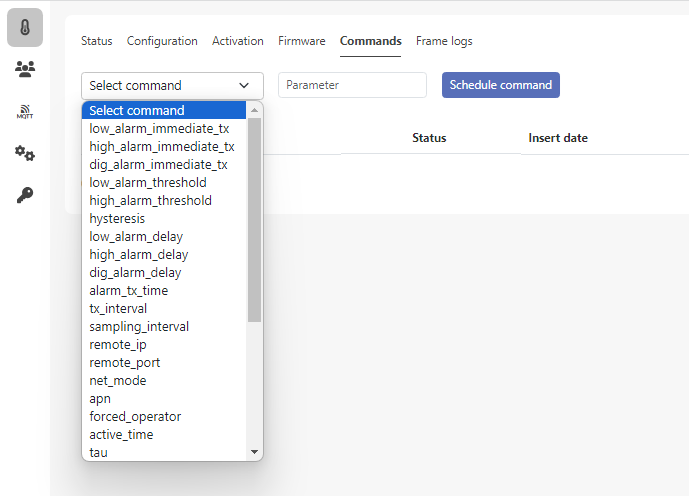
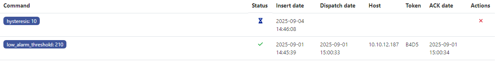

# MQTT integration

The MQTT integration publishes all the device data as JSON over MQTT. To receive data from your device, you need to subscribe to its MQTT topic.

## Topic
The default uplink topic is: `application/COAP/device/{{serial}}/uplink`

The placeholder *{{serial}}* is replaced with the serial number of the device (e.g., *A0000001*). For example, the data produced by the device *A0000001* will be available on the topic `application/COAP/device/A0000001/uplink`

As defined by the MQTT protocol, you can subscribe to all the devices enrolled in the driver by using the `+` wildcard:   
`application/COAP/device/+/uplink`

The default uplink topic can be modified:
1. Access the driver web interface
2. Navigate to Integrations → MQTT
3. Edit the field *Uplink topic*
4. Press *Save*  

Note: it is not necessary to restart the driver, the modification will take effect within 10 minutes

## Using an external broker
The driver comes with a built-in MQTT broker (VerneMQ) which runs as a Docker container. By default, the driver publishes the device data on the built-in broker.

Optionally, the driver can be configured to publish to an external, pre-existing MQTT broker.  
To configure the external broker:
1. Access the driver web interface
2. Navigate to Integrations → MQTT
3. Select *Use external broker*
4. Fill in the required fields (*Broker URL*, *Username*, *Password*, *QoS*). The parameters are necessary for the driver to connect to the external broker.  
If you specify a `mqtts://` address, the driver will publish using MQTT over TLS
5. Press *Save*

Note: it is not necessary to restart the driver, the modification will take effect within 10 minutes

## MQTT payload
The MQTT payload contains the device data, formatted as JSON

Example:
```json
{
	"protocol": 2,
	"rx_date": "2025-09-04T06:45:36+00:00",
	"hw_type": "17",
	"message_type": "rx",
	"serial": "A0000001",
	"join_date": "2025-08-01T15:20:24.000Z",
	"last_seen": "2025-08-29T15:45:36.000Z",
	"data": {
		...
	}
}
```

The JSON contains the following fields:
| Name	| Type | Description | 	Example  |
| ----- | ---- | ----------- | --------  | 
| protocol | number | Indicates the version of the MQTT protocol. Version 2 is currently the only supported version | 2 |
| rx_date | timestamp | Date and time of the reception of the uplink by the driver, in ISO 8601 format. This may differ by a few milliseconds or seconds from the actual date and time the device sent the packet, depending mainly on the network latency | "2025-09-04T06:45:36+00:00" |
| hw_type | string | Identifies the type of device that originated the uplink. See [Supported device types](#supported-device-types) | "17" |
| message_type | string | Identifies the CoAP resource accessed by the device. It depends on the device family protocol. Common used resources include `rx` (sending data), `fota` (requesting the firmware), `ack` (sending command acknowledgement) | "rx" |
| serial | string | Serial number of the device which has transmitted the uplink | "A0000001" |
| join_date | string | Date and time of the join date, in ISO 8601 format. This is the moment the device has established the security context with the driver. It usually corresponds to the date of the last reboot of the device, or the moment the join was finally successful after one or more retries | "2025-08-01T15:20:24.000Z" |
| last_seen | timestamp | Date and time of the moment the device was last seen by the driver, before the current uplink, in ISO 8601 format | "2025-09-04T05:45:36.000Z" |
| data | object | It contains the actual content of the device uplink. Its format depends on the family of device, please refer to the relevant device documentation. For example, refer to the [VIDI Transmitter](vidi-transmitter.md) docs for the *VIDI Transmitter* family |  |

## Supported device types
| hw_type | Device family | Description | 
| ------- | ---- | ----------- |
| 14 | VIDI Transmitter | VIDI Open Close |
| 16 | VIDI Transmitter | VIDI Flow |
| 17 | VIDI Transmitter | VIDI Pressure |
| 18 | VIDI Transmitter | VIDI Temp |
| 23 | VIDI Transmitter | VIDI Level |
| 24 | VIDI Positioner | VIDI Positioner |
| 28 | VIDI PRV | VIDI PRV |
| 29 | VIDI Transmitter | VIDI Positioner with ext. antenna |
| 31 | VIDI Transmitter | VIDI Leak |

## Scheduling downlinks
Downlinks are used to send commands and configurations to the device. Downlinks can be scheduled in two ways: via web interface or programmatically, using the REST APIs.  
️️  
⚠️ Given the nature of the devices, the dispatch of the command is not immediate. The commands are put in a queue by the driver and they will be sent to the device inside the response to the next transmission.

### Downlink states
Once created, the downlink can assume the following states:
| code | name | description |
| ---- | ---- | ----------- |
| 0 | Pending, waiting for the device to come online | This is the initial state. The downlink is in the driver queue. While it is pending, it can be canceled, either through the web interface (pressing the button *Cancel* in the column *Actions*) or via REST APIs | 
| 1 | Canceled by the user | The downlink has been canceled while in *Pending* state |
| 2 | Sent, waiting for acknowledgement | The driver has just sent the downlink to the device and it is waiting for confirmation |
| 3 | Sent and acknowledged | The downlink has been successfully dispatched and accepted by the device | 
| 4 | The command was not accepted by the device | The downlink has been successfully dispatched to the device but the content was not accepted |  
| 5 | Sent but not acknowledged | The driver has sent the downlink to the device but never received confirmation. Either the downlink was lost, or the acknowledgement from the device was not received | 

### Using web interface
The web interface provides a user-friendly way to select the command, configure parameters, and check the execution status.
1. Open the web interface
2. Navigate to menu **Devices**
3. Go into the target device
4. Navigate to the **Commands** tab
5. Select the desired command or configuration from the list
6. Insert the parameter, if needed. For commands, set the parameter to `1`
7. Press **Schedule command**



The table shows the history of the downlinks for the device, with a retention that is defined in the `compose.yaml` file (default 30 days).

The client can follow the outcome of the downlink by accessing the table. 
The table shows for each downlink:
- the current state (see [Downlink states](#downlink-states))
- date and time it was inserted (scheduled)
- date and time it was dispatched to the device
- date and time it was delivered and acknowledged by the device



### Using API
Downlinks can also be scheduled using REST APIs, in order to enable automation, scalability and integration to already existing systems.

Open the web interface and navigate to the menu **API Docs**.
The page provides the necessary documentation, in OpenAPI format, to execute the API request to the driver.

⚠️ Note: each endpoint requires a Bearer token. Clients must include the header: `Authorization: Bearer <token>`

If the client provides a callback URL, the driver will notify the client with the status of the downlink. 
When the downlink status changes, the driver will execute an HTTP POST request to the client callback URL. 
The request body is a JSON object containing:
- command_id: client-defined downlink identifier, provided by the client at the moment of insertion
- status: new status of the downlink, see [Downlink states](#downlink-states)
- timestamp: unix timestamp (in seconds) of the event

Example:
```json
{
	"command_id": "0219dfb3-00a8-40e6-90ea-1f83e807e885",
	"status": 3,
	"timestamp": 1757077169
}
```

## Notes about transmission scheme
When a device is activated, the security context is not established yet. For this reason, the device first connects to the network (NB-IoT or LTE-M) and executes the JOIN to the CoAP server. 

In order for the JOIN to complete, the device must already be enrolled in the CoAP driver (see *Enrolling devices* part in the [First launch](first-launch.md)). If the JOIN fails, the device will retry indefinitely at the configured transmission interval. 

When the JOIN is completed, the security context is established so the device can start sending data. 
At first, the device sends data for three times at a 5-minute interval [^1]. These three transmissions are useful in the field to evaluate that the installation is successful. After this, the device will start transmitting at the defined interval (*tx_interval*, default 60 minutes). 

[^1]: The interval is not exactly 5 minutes as the device must synchronize with its sampling interval.

